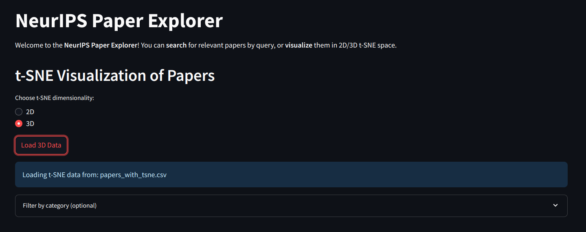
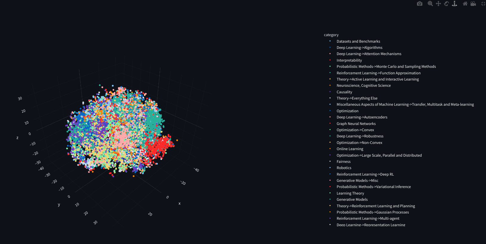

# NeurIPS Paper Search Project

This project is a semantic search tool for NeurIPS papers from the past 10 years. It uses **ChromaDB** for vector storage, **sentence-transformers** for semantic embeddings, and includes a **Streamlit-based UI** for interaction. Additionally, a t-SNE plot helps visualize clusters of similar papers in 3D space.

## **Features**

- Semantic search on NeurIPS papers.
- Categorization of papers into specific fields.
- 3D t-SNE visualization of paper embeddings.
- Interactive web app using Streamlit.

## **Project Structure**

```plaintext
.
├── chromadb                # Database folder for ChromaDB
├── data
│   └── neurips_papers_last10years.json  # JSON file containing the NeurIPS paper data
├── paper_categories.csv    # CSV file mapping paper titles to categories
├── papers_with_tsne.csv    # CSV file with embeddings and t-SNE coordinates
├── requirements.txt        # Python dependencies for the project
├── scripts
│   ├── categorize_papers.py       # Script for categorizing papers
│   ├── ingest_data.py             # Script to ingest paper data into ChromaDB
│   ├── query_engine.py            # Query engine for semantic search
│   └── tsne_visualization.py      # Script for generating t-SNE plots
├── streamlit_app
│   └── app.py              # Streamlit app for interactive paper search
├── tsne_3d_plot.html       # Pre-generated 3D t-SNE visualization
└── setup.py                # Setup script for the project
```

````

---

## **Getting Started**

### **Prerequisites**

- Python 3.10+
- pip

### **Installation**

1. Clone the repository:

   ```bash
   git clone https://github.com/siddharth899/neurips-paper-search.git
   cd neurips-paper-search
   ```

2. Install required dependencies:

   ```bash
   pip install -r requirements.txt
   ```

3. Download the paper data into the `data` folder (if not already provided).

---

### **Usage**

#### **Ingest Data**

To prepare the database for semantic search:

```bash
python scripts/ingest_data.py
```

#### **Categorize Papers**

Categorize papers into specific fields:

```bash
python scripts/categorize_papers.py
```

#### **Run Streamlit App**

Start the Streamlit app to perform semantic searches:

```bash
streamlit run streamlit_app/app.py
```

#### **Generate t-SNE Visualization**

To create or update the t-SNE plot:

```bash
python scripts/tsne_visualization.py
```

---

## **Screenshots**

### **1. Semantic Search Interface**


### **2. 3D t-SNE Visualization**

<p align="center">
  
  
</p>

---

## **Contributing**

Feel free to contribute to this project:

1. Fork the repository.
2. Create a new branch:
   ```bash
   git checkout -b feature-name
   ```
3. Commit changes:
   ```bash
   git commit -m "Description of changes"
   ```
4. Push the branch:
   ```bash
   git push origin feature-name
   ```
5. Open a pull request.

---

## **License**

This project is licensed under the MIT License. See the [LICENSE](LICENSE) file for details.

---

## **Acknowledgments**

- [SentenceTransformers](https://github.com/UKPLab/sentence-transformers)
- [ChromaDB](https://chromadb.com)
- [NeurIPS](https://neurips.cc)

---

## **Contact**

For any inquiries, feel free to [reach out](https://github.com/siddharth899).
````
